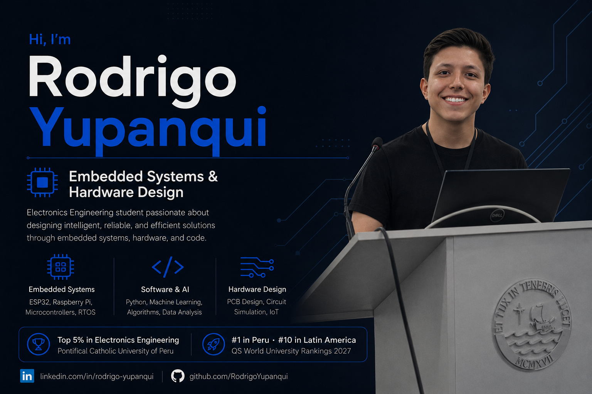

<h1>Hi, I'm Rodrigo Yupanqui 👋</h1>

<h3>Electronics Engineering Student | Embedded Systems | Hardware & Firmware Design</h3>

I build intelligent electronic systems that connect hardware, firmware, sensors, data acquisition, and real-world engineering applications.

---

## 👨‍💻 About Me

I am an **Electronics Engineering student at the Pontificia Universidad Católica del Perú — PUCP**, ranked among the **top 5% of Electronics Engineering students** and the **top 10% of the Faculty of Science and Engineering**.

I currently work as an **Electronics Engineering Intern at DIACSA**, contributing to embedded and industrial electronic systems involving sensors, firmware, instrumentation, data acquisition, and hardware integration.

My main interests include:

* Embedded systems and firmware development
* Industrial electronics and instrumentation
* Sensor integration and data acquisition
* Computer vision and edge AI
* IoT and connected electronic systems
* Energy efficiency and sustainable engineering
* Hardware design, validation, and prototyping

I enjoy transforming engineering requirements into functional prototypes by combining electronics, programming, mechanical integration, and data processing.

---

## 🚀 Featured Projects

### 🛣️ CrackScan — Autonomous Pavement Inspection Rover

Autonomous mobile rover developed to detect and quantify pavement defects using **computer vision, artificial intelligence, LiDAR, and embedded control**.

The system integrates:

* YOLOv11n running on a Raspberry Pi 5
* LiDAR-based pothole reconstruction and volume estimation
* Visual line-following navigation
* ESP32-based motor and steering control
* Real-time communication between embedded modules
* Web dashboard for monitoring and data visualization

My contributions focused on the **electronic hardware integration, embedded-system architecture, communication between modules, sensor and actuator integration, and web monitoring interface**.

---

### 📡 Industrial Embedded and Instrumentation Systems

Development and integration of embedded electronic solutions for industrial and mining applications at **DIACSA**.

Areas of work include:

* Microcontroller-based firmware
* LiDAR and inertial sensor integration
* Industrial data acquisition
* Electronic instrumentation
* Communication between embedded modules
* Hardware testing and system validation

---

### 🛰️ CubeSat Environmental Monitoring System

Embedded system for environmental data acquisition and wireless telemetry using microcontrollers, sensors, and LoRa communication.

The project includes firmware and data-processing components developed with **C, C++, and Python**.

  

---

### ⚡ Energy Efficiency and Sustainable Engineering

Participant in the **Siemens Regional Energy Efficiency Program**, applying engineering analysis to identify opportunities for energy optimization and improved system performance.

I am particularly interested in applying embedded electronics, industrial data, and automation to the energy and mining sectors.

---

## 🧰 Technologies

### Embedded Systems and Firmware

  
  
  
  
  
  

### Programming, Data and Computer Vision

  
  
  
  
  
  

### Electronics and Engineering Tools

  
  
  
  

### Software and Development

  
  
  
  
  

---

## 🏅 Experience and Leadership

* Electronics Engineering Intern at **DIACSA**
* Director of Projects at **IEEE Computer Society PUCP**
* Selected participant in **Huawei Seeds for the Future**
* Participant in the **Siemens Regional Energy Efficiency Program**
* Experience leading and developing multidisciplinary engineering projects
* Volunteer instructor in electronics workshops
* Experience presenting and documenting technical and research projects

---

## 📚 Currently Exploring

* Embedded Linux and edge computing
* Advanced firmware architectures
* Industrial communication and instrumentation
* LiDAR-based measurement systems
* Intelligent condition-monitoring systems
* Computer vision for industrial inspection
* Hardware design for energy and mining applications

---

## 📊 GitHub Analytics

---

### Let's build technology that connects electronics, intelligence, and real-world impact.

